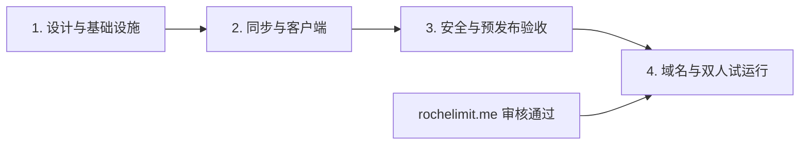

# 联网版本实施路线图

> 状态：产品边界已确认，尚未开始实现。本文使用 4 个阶段管理联网版交付；现有离线 Android、离线 Web、DST1 和 DSTB1 规则继续以既有文档为准。

## 首版目标

首版只服务一个空间内的 1 名管理员和 1 名执行者。

```text
管理员邮箱登录联网 Web
→ 邀请执行者
→ 发布、更新或取消任务
→ 联网 Android 前台同步并显示应用内通知
→ 执行者离线完成任务
→ 恢复网络后上传结果
→ Web 查看结果、冲突和审计记录
→ 按权限导出或删除数据
```

上述流程、安全与隐私门禁、离线版本回归和免费额度检查全部通过，首版才算完成。

## 产品边界

| 产品 | 首版职责 | 数据与网络边界 |
| --- | --- | --- |
| 离线 Android | 保持现有执行、历史、积分和 DSTB1 | 现有包名和 Room；不得声明网络权限 |
| 联网 Android | 登录、空间任务、离线执行、同步和应用内通知 | 独立包名、签名和 Room；允许联网 |
| 离线 Web | 保持任务生成、模板、DST1 和本地备份 | 数据只在 IndexedDB，不调用云 API |
| 联网 Web | 管理成员与任务、local-first 编辑、同步和结果查看 | IndexedDB 缓存 + Workers/D1 云端事实 |
| Workers + D1 | 鉴权、授权、版本、同步、结果和审计 | 预发布与生产分库，使用 Cloudflare 免费版 |

四个客户端构建共享协议、领域规则、任务编辑器、基础 UI 和对应测试。账号、成员、同步、冲突和联网结果查看属于联网专属模块；离线构建必须在编译期排除联网依赖，不能只隐藏入口。

## 已确认规则

- 使用“空间 + 成员角色”模型。首版只有管理员和执行者，界面限制为两人，但数据模型不写死人数。
- 唯一管理员邮箱由生产密钥白名单指定；执行者只能通过一次性邀请加入。
- 使用邮箱验证码和可撤销设备会话；访问令牌短期有效，连续 30 天未联网后重新验证邮箱。邮件由可替换的外部服务发送。
- Web 管理员发布、更新和取消任务；Android 执行者提交执行事件和结果。
- 任务更新生成新版本，取消写事件，删除为归档；普通操作不能抹除历史。
- 执行结果绑定执行者当时看到的任务版本。旧版本结果保留并等待管理员确认。
- 同账号多设备提交时，首个被服务器接受的终态结果生效；后到提交保留为重复记录。所有命令必须幂等。
- 联网 Web 是 local-first PWA；Android 与 PWA 可继续执行已缓存任务，恢复网络后增量同步。
- 同步发生在启动、恢复前台、网络恢复、手动刷新，以及页面持续可见时最多每 5 分钟一次。
- 首版没有远程推送，只显示同步后取得的应用内通知。FCM、OPPO PUSH 和小米推送后置。
- 首版不做端到端加密。Workers 可读取任务内容，必须实施空间级授权、最小日志和密钥隔离。
- 不自动上传离线数据。联网 Android 只支持主动导入 DST1，不迁移完整 DSTB1 历史、积分和设置。
- 管理员可导出完整空间；执行者只能导出自己的数据。云端导出使用新的版本化格式。
- 删除默认有 30 天恢复期；邮箱二次验证后可立即永久删除。
- 不接入产品分析、崩溃上传或行为遥测。
- 中国大陆只提供尽力可用，不承诺低延迟、实时性或 SLA。
- D1 只使用免费版自带的 7 天时间点恢复，不建设额外长期备份系统。

## 四阶段流程



### 阶段 1：完成设计、共享边界与云端基础设施

任务：

1. 更新 [`preview.md`](preview.md)，定义账号、空间、角色、任务版本、分配、执行事件、通知、导出和删除规则。
2. 定义独立的同步协议、稳定错误码、分页游标和 TypeScript/Kotlin 共用测试向量；DST1 不承担账号和同步语义。
3. 写出任务更新/取消与离线执行、多设备提交、命令重放、成员移除和会话过期的状态矩阵。
4. 抽取 Web 与 Android 共享核心，建立离线/联网四个构建入口和测试矩阵。
5. 保证离线 Web 不包含云 API 代码，离线 Android 不包含联网依赖或网络权限。
6. 建立 Worker API、静态资源项目和本地/预发布/生产环境；预发布与生产使用不同 D1 和密钥。
7. 定义云端数据表和版本化 migration，完成统一错误、安全响应头、CORS、索引和 D1 恢复手册。
8. 接入外部事务邮件，实现验证码、令牌轮换、会话撤销、管理员白名单、空间创建和执行者邀请。
9. 使用 `*.workers.dev` 建立等待域名审核期间的预览环境。

验收：四个构建可独立生成；离线产物无联网能力；只有白名单管理员能创建空间；预发布不能访问生产 D1；完成一次非生产恢复演练。

### 阶段 2：完成同步服务与联网客户端

任务：

1. 实现空间单调游标和增量变更流，禁止同步热路径全表扫描。
2. 为客户端命令增加事件 ID、幂等键、基线版本和事务保护，支持分页、续传和安全重试。
3. 实现任务修订、分配、取消、归档、不可变执行事件和正式结果选择。
4. 实现旧版本结果、多设备重复提交和管理员改选，并保留完整审计链。
5. 每次任务变化创建应用内通知事件，提供增量拉取、未读计数和标记已读接口。
6. 成员移除或会话撤销后立即停止返回空间数据，并要求客户端联机后清除失去授权的缓存。
7. 联网 Web 增加登录、空间、邀请、任务、结果界面，以及隔离的 IndexedDB、outbox、PWA 离线外壳和同步状态。
8. 联网 Android 使用独立包名与签名，增加登录、云任务 Room、outbox、应用内通知和冲突界面，并复用现有执行状态机。
9. 两端支持启动、恢复前台、网络恢复和手动同步；不增加常驻轮询或远程推送。
10. 联网 Android 只提供 DST1 主动导入，不迁移完整 DSTB1 历史。

验收：重放、乱序、冲突和多设备测试通过；两端断网后可恢复同步；会话过期不丢 outbox；API 26/33/35 关键流程通过；离线与联网共享功能一致。

### 阶段 3：完成安全、隐私与预发布验收

任务：

1. 实现管理员完整导出、执行者个人导出、30 天可恢复删除和立即永久删除。
2. 更新 `PRIVACY.md`、首次云端提示、设置与诊断说明，明确任务会上传且运营者技术上可读取。
3. 完成 API 授权矩阵、验证码滥用、邀请枚举、IDOR、重放、令牌窃取、恶意 DST1、CORS 和依赖审核。
4. 检查 Worker、邮件和客户端日志，确保不含任务正文、验证码、令牌或密钥。
5. 在 `*.workers.dev` 跑双人端到端、断网、冲突、成员移除、导出、删除和恢复场景。
6. 记录 Worker 请求、D1 行读写、数据库体积和邮件数量；在 50%、75%、90% 设置预警和降频策略。
7. 使用移动、联通和电信真实网络做尽力测试，并记录中国大陆已知限制。

验收：完整主流程通过；离线产品无回归；预发布持续使用不触及免费限额；失败时客户端保留 outbox 并提供可重试提示。

### 阶段 4：切换域名并进行双人试运行

前置：`rochelimit.me` 审核通过，阶段 3 验收完成。

任务：

1. 从阿里云导出并核对全部 DNS 记录，在 Cloudflare 添加 zone，但暂不切换 nameserver。
2. 配置 `app.rochelimit.me`、`api.rochelimit.me`、预发布子域，以及邮件 SPF、DKIM、DMARC 和退信域。
3. 按正确顺序处理现有 DNSSEC，随后在阿里云把权威 nameserver 改为 Cloudflare 分配值。
4. 从多网络验证 NS、TLS、Web、API、CORS、PWA 更新和验证码投递；保留原 DNS 导出和回切步骤。
5. 构建、独立签名并私下分发联网 Android APK；生成 SHA-256 和发布证据。
6. 生产 migration 前记录 D1 恢复点，部署固定版本的 Worker 与 PWA，由两名成员完成真实主流程。
7. 观察一周请求、D1、邮件、错误和同步积压，决定继续试运行、修复后重试或回滚。

验收：正式域名稳定使用 HTTPS；生产和预发布完全隔离；双人确认主流程可用；离线产品没有回归；免费额度和地域边界没有被突破。

## 免费版门禁

以下为 2026-08-16 制定路线图时的官方免费层边界，上线前必须重新核对：

| 资源 | 当前免费边界 | 控制措施 |
| --- | --- | --- |
| Workers 动态请求 | 100,000 次/日 | 增量游标、5 分钟可见轮询、抖动、退避和阈值降频 |
| D1 行读取 | 5,000,000 行/日 | 热查询使用索引并检查查询元数据 |
| D1 行写入 | 100,000 行/日 | 合并同步批次，避免轮询产生无意义写入 |
| D1 存储 | 总计 5 GB；单库 500 MB | 预发布/生产分库并监控体积 |
| D1 Time Travel | 免费版 7 天 | migration 前检查恢复点并演练恢复 |
| Workers 静态资源 | 静态请求免费且不限量 | 普通静态资源不启用 `run_worker_first` |

参考：[Workers 限制](https://developers.cloudflare.com/workers/platform/limits/)、[静态资源计费](https://developers.cloudflare.com/workers/static-assets/billing-and-limitations/)、[D1 定价](https://developers.cloudflare.com/d1/platform/pricing/)、[D1 限制](https://developers.cloudflare.com/d1/platform/limits/)、[D1 Time Travel](https://developers.cloudflare.com/d1/reference/time-travel/)。

达到 75% 用量时延长自动检查间隔；达到 90% 时停用定时检查，但保留手动同步和关键写入。达到平台硬限制时，客户端必须保留本地 outbox，避免无界重试。

## 统一交付标准

每个阶段必须：

1. 先更新产品或网络契约，再修改实现。
2. 定义幂等、事务、失败回滚、审计和重放结果。
3. 同时验证受影响的离线/联网 Android 与离线/联网 Web。
4. 覆盖正常、边界、越权、重复、乱序、离线和恢复测试。
5. 检查日志和版本控制中没有密钥、令牌、验证码或任务正文。
6. 记录测试结果、已知限制、刻意后置项和免费额度影响。

## 首版后置

- FCM、OPPO PUSH、小米推送及远程通知；
- 完整 DSTB1 历史、积分和设置迁移；
- 端到端加密；
- 公开注册、多个管理员、多个空间和细粒度角色；
- 协作式“一人完成即全组完成”任务；
- 中国大陆专用后端、ICP 流程或大陆 SLA；
- 付费扩容、长期异地备份、高级可观测性和行为遥测；
- 应用商店发布。

后置推送必须复用现有通知事件，只携带非敏感事件标识，客户端仍通过鉴权增量同步获取正文。
